 

 

<table>
<tr>
<td width="50%" valign="top">

### 🧑‍🚀 About the astronaut

- 🇫🇷 Full-stack developer from France
- 🎓 Student at [Epitech](https://www.epitech.eu/)
- 👯 Open to collaboration on new projects
- 🤝 Always happy to help, and to be helped
- 📝 I write articles on [Medium](https://medium.com/)
- ⚡ Fun fact: I think I am funny

</td>
<td width="50%" valign="top">

### 🛰️ Current mission

- 🌱 Learning **Rust**, **Java** and **Python**
- 🧱 Building projects on [agency.jud3v.fr](https://agency.jud3v.fr)
- 💬 Ask me about **React, PHP, Laravel, Next.js, Symfony, Docker**
- 📄 Experience: [agency.jud3v.fr/about](https://agency.jud3v.fr/about)

</td>
</tr>
</table>

 

## 🚀 Tech arsenal

### Frontend

        
     

### Backend & Languages

               

### CMS & E-commerce

 

### Databases & Infra

             

### Tools

          

 

## 📡 Telemetry

  

  

 

## 🌌 Open a comms channel

  

  

